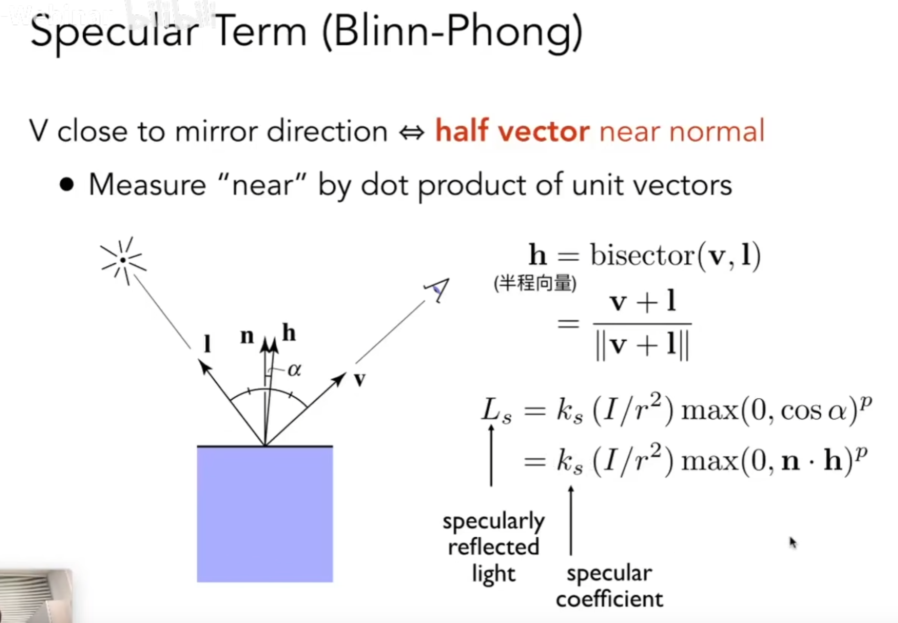

# 着色
冯氏反射模型：高光、漫反射、环境光照（间接）

着色是局部的，只考虑自己，不考虑其他物体，影子不属于着色

物体的亮度与光线的角度相关

# 漫反射
和观察角度无关

# 高光
与观察角度有关，通过角平分线方向的向量和法线夹角计算

> 一般在布林冯模型中p是100到200
> 处理指数运算可以用快速幂算法，复杂度为logn

# 环境光
可以看做常量，需要用到全局光照知识

布林冯反射模型是基于经验，而不是真实物理规则的模型

# 着色频率（所有法线记得要归一化）
逐顶点法线着色，根据这个点所有相邻面的法线加权（对应多边形的面积）平均得到一个顶点的法线（也可以不加权平均）

逐像素法线着色，利用重心坐标

实际情况下，法线一般不是实际运行时计算的，计算量太大，一般是烘焙时就做好了。

# 管线Pipeline

# 纹理
模型转成UV图

无缝纹理被称为TilabledTexture，有一种王氏Tile算法可以处理

# 三角形的重心坐标
重心坐标会在透视变化以后改变

# 双线性插值
纹理过小产生锯齿的解决方案：水平方向上做两次插值，垂直方向做一次插值，得到像素点的颜色插值，使材质贴图平滑
双三次插值不是用线性的插值

# Mipmap
每一级的map长宽和分辨率缩小一半，总的存储大小增加了三分之一
纹理过大产生采样走样的解决方案：让一个像素点覆盖纹理的大小变小，允许做近似的正方形范围查询

# 三线性插值
双线性插值的基础上，在Mipmap的层与层之间再加计算一次插值，开销小效果好

# 各向异性过滤(采样)
三线性插值会产生远处过于模糊的问题，利用各向异性过滤可以部分解决远处模糊的问题，采用各向异性会提高显存的占用，越高占用越**逼近**原占用的三倍，但是对运算的性能几乎没有影响，所以游戏中各向异性可以随便关掉

# 环境贴图
纹理可以用来表示环境光
- Sphere Map:不同的环境光(光照信息)可以记录在一个球面上，会有扭曲问题
- Cube Map:也可以记录在一个立方体上(更常见)，没有扭曲问题，但是光照方向需要额外计算

# 凹凸贴图
纹理可以定义相对高度，通过贴图求出假的法线，给一个假的着色效果，但是不改变任何的几何信息，在边缘的地方或者投影会露馅
> 位移贴图真的会移动顶点，但是要求模型得足够细，三角面足够多，能够跟上纹理的变化速度，DirectX的API会根据需要控制模型的精细程度(原理:曲面细分)