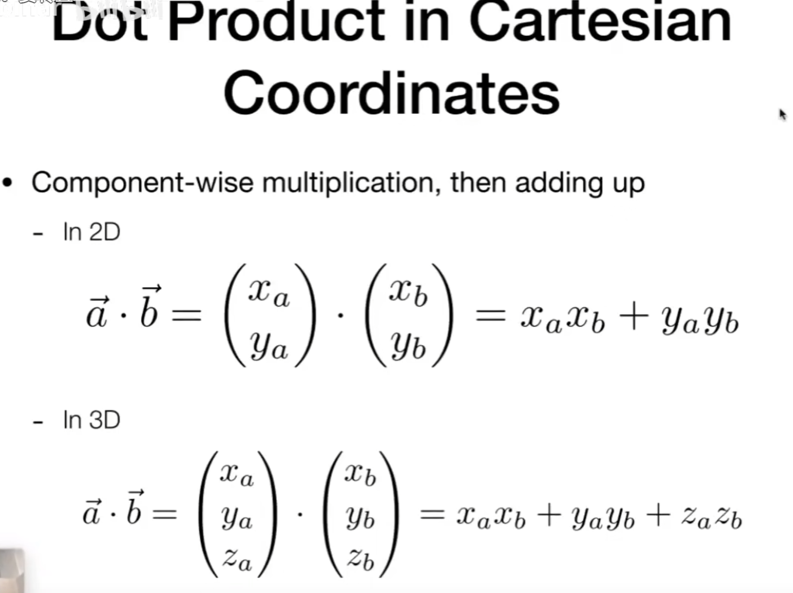

# 向量
  
## Vector Normalization（归一化处理）

将向量转化为**单位向量**，单位向量可以只代表方向，所以用途广泛

两个相互垂直的单位向量可以表示任何其他的向量


## 点乘

点乘可以快速地获取两个向量的夹角，两个单位向量尤其简单

计算规则

点乘的矩阵写法


应用：
1. 判断两个向量的夹角
2. 判断**前和后**
3. 正交分解（投影）

## 叉乘  
利用x向量与y向量的叉乘，得到一个z向量，通过这三个向量，可以实现一个三维坐标系，利用左手定则实现x，y叉乘的是左手坐标系，利用右手定则则是右手坐标系。

Unity引擎使用的是左手坐标系，所以z轴朝向xy平面后方（大多数工业引擎都是用的右手坐标系，而游戏引擎反而更加常用左手坐标系）

注意：MonoBehavior提供的叉乘函数
``` C# 
public static Vector3 Cross(Vector3 lhs, Vector3 rhs)
```
就是用的左手螺旋定则（废话，人家用的就是左手坐标系），所以当调用函数
``` C#
Vector3.Cross(a,b)
```
返回值为正的时候，a在b的左边，反之，a在b的右边

叉乘的矩阵写法


应用：
1. 判断**左和右**
2. 判断**里和外**（判断左和右的进阶，你可以通过判断一个点与一个图形所有外边左右位置关系是否一致来判断这个点是否在这个图形内部）
> 又称为重心坐标，常用来光栅化判断一个点（像素）是否位于三角形内部，从而判断是否要对一个像素点进行**着色**（为什么是三角形？建模都是用一堆三角形堆起来的！）
# 矩阵
应用在变换上，矩阵其实很简单

矩阵相乘的前提，第一个矩阵的列数必须等于第二个矩阵的行数，举例：一个6 * 5的矩阵乘以一个5 * 8的矩阵，最后会得到一个6*8的矩阵，好像中间的5被消掉了一样

相乘得到的矩阵特征举例：第二行第五列的数字 **等于** 第一个矩阵第二行的行矩阵乘以第二个矩阵第五列的列矩阵得到的数字


> 注意：矩阵乘法没有交换律

# 变换

由于我们要处理的右矩阵往往是一个向量（即只有一列，但是有n行的**列矩阵**），所以我们的变换矩阵**只需要关心列数**，行数是随意的（~~反正多了几行也不会算......~~)

图形学的重中之重，先举几个简单的例子

镜像变换矩阵


矩阵的转置


单位矩阵没用，但是他可以用来定义逆矩阵，矩阵和他的逆矩阵相乘会得到单位矩阵

