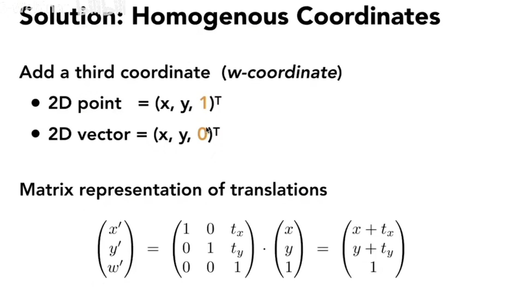

# 概述
模型（Modeling）变换和视图（View）变换

# 线性变换
包括缩放变化、镜像变换、平移变换、旋转变换等

与一个矩阵相乘就能实现的变换称之为线性变换（~~不严谨，但无所谓~~）

# 齐次坐标（Homogenous Coordinates）
引入的目的：将一些难以用一个矩阵描述的变换（如平移）（仿射变换）统一表述

向量具有平移不变性，但点平移以后会变

逆变换就是乘以变换矩阵的逆矩阵（想想命令模式的还原）

仿射变换 = 线性变换 + 平移变换