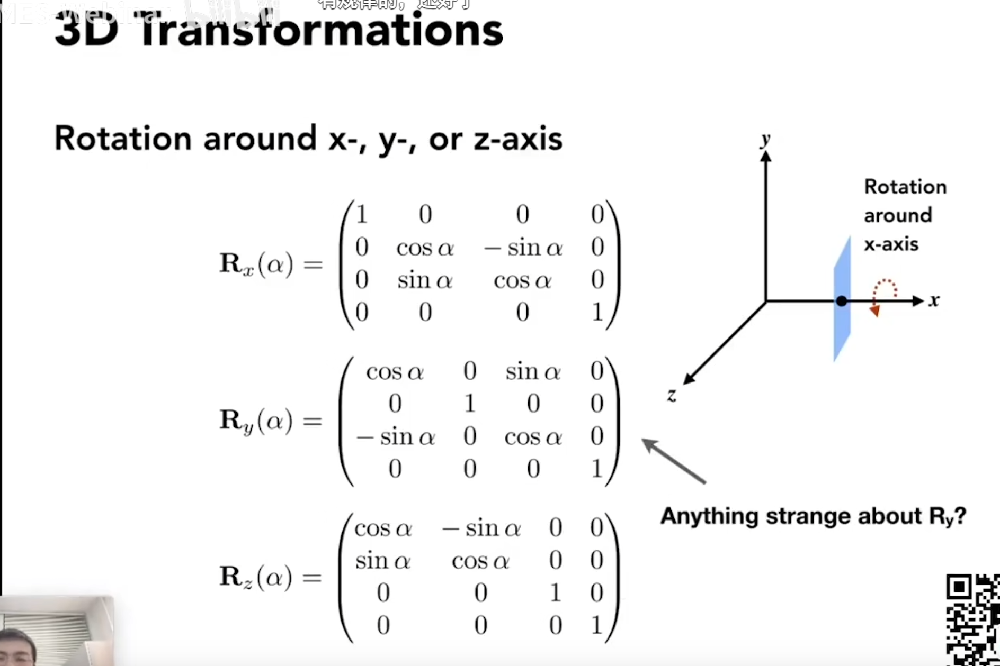
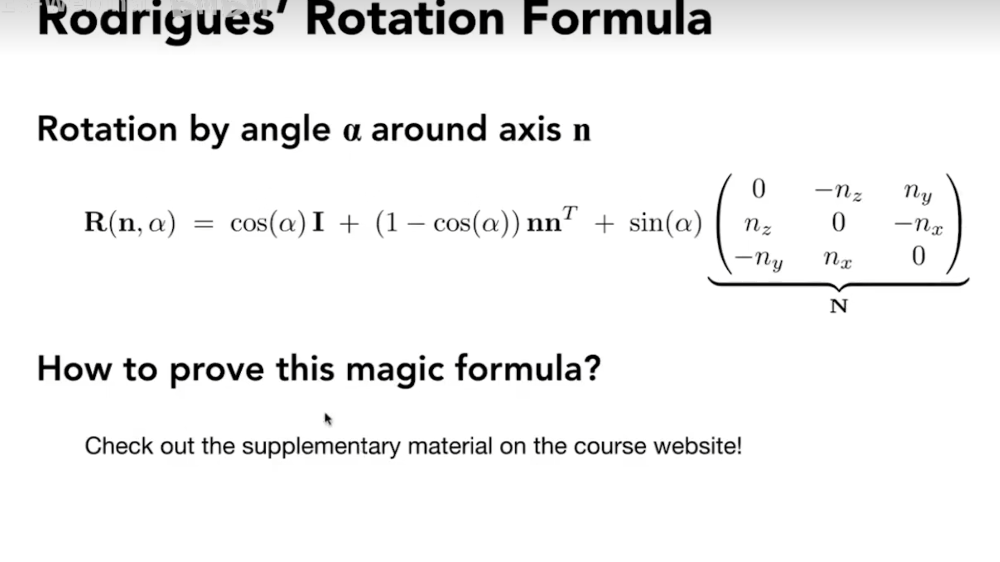

# 正交矩阵

在数学上，如果一个矩阵的转置矩阵等于一个矩阵的逆矩阵，那么称呼这个矩阵为正交矩阵

旋转矩阵属于正交矩阵

计算逆矩阵的时候会耗费大量性能，利用正交矩阵的这个特性可以节省性能

3D旋转矩阵

罗德里格斯旋转公式

四元数替换欧拉角可以解决万向节死锁的问题并能保证旋转的平滑插值（两个旋转矩阵的平均值并不是平均角度的旋转矩阵）

# 模型变换 Model

模型坐标=>世界坐标

# 视图变换 View/Camera

世界坐标=>观察坐标

# 投影变换 Projection（正交投影Orthographic和透视Perspective投影）

透视投影变换中要保证：
- near面不变
- frustum任意一个与near面平行的截面要压缩成near面的大小
- far面的中心点不变

观察坐标=>裁剪坐标（点到xy平面的距离会变远）

经过裁剪以后，裁剪坐标再进行齐次除法(裁剪坐标=>NDC坐标)

用来描述渲染空间的六个属性l,r,b,t,f,n代表的是坐标,不是长度

Unity的投影变换和图形学教材的投影变换的区别原因：
- Unity假设裁剪空间位于Z轴的中心
- Unity后续还有一步齐次除法的操作
# Frustum 视椎体

定义一个Frustum，需要fovY和aspect(长宽比)两个参数（near和far此时仍然位置 ）

tan(fovY/2) = t/abs(n)

aspect = r/t