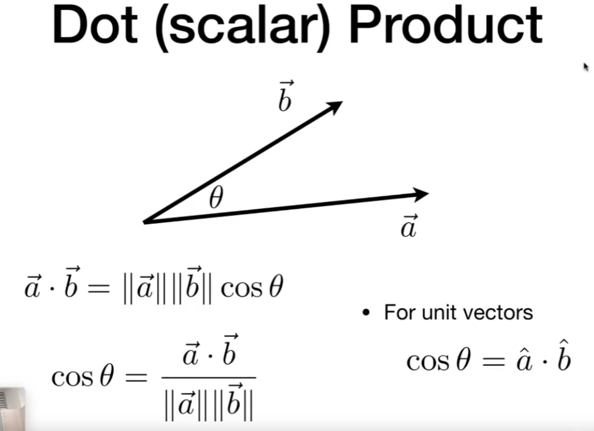

## 回顾线性代数的目的
图形学依赖于线性代数
## 内容
+ 向量
  
  Vector Normalization（归一化处理）

  将向量转化为**单位向量**，单位向量可以只代表方向，所以用途广泛

  两个相互垂直的单位向量可以表示任何其他的向量

  

  点乘可以快速地获取两个向量的夹角，两个单位向量尤其简单

  

  计算规则

  
  

应用：光线夹角都是通过点乘来计算的

+ 矩阵
