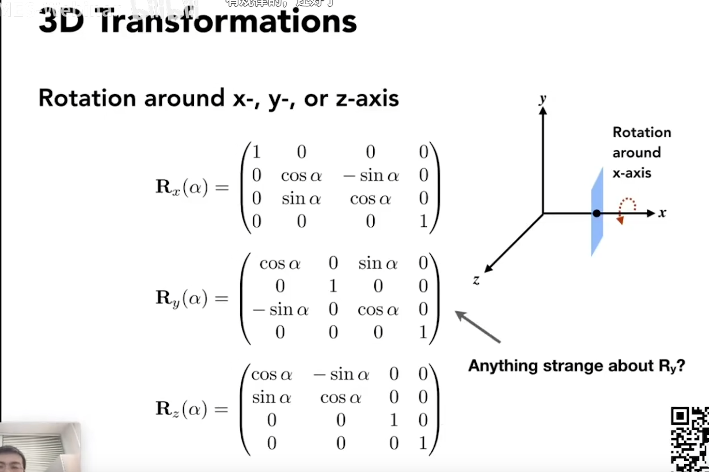

在数学上，如果一个矩阵的转置矩阵等于一个矩阵的逆矩阵，那么称呼这个矩阵为正交矩阵

**旋转矩阵就是正交矩阵**

正交矩阵的作用很大，因为计算机在计算逆矩阵的时候会耗费大量性能，而转置矩阵则不需要那么高的性能

绕谁谁不变

罗德里格斯旋转公式

四元数替换尤拉角可以解决万向节死锁的问题并能保证旋转的平滑插值（两个旋转矩阵的平均值并不是平均角度的旋转矩阵），四元数的本质是两次反射
> 有兴趣再去研究四元数

Model（摆放模型和照相机）、View（找角度）、Projection（拍照）合称MVP变换

# 模型变换 Model
一般来说，从3D建模软件导出的坐标系都是以**模型的中心**为坐标系原点的局部坐标系，模型变换的本质就是要将模型坐标系转变为我们的世界坐标系

# 视图变换 View/Camera
 
# 投影变换 Projection（正交投影Orthographic和透视Perspective投影）
正交投影和透视投影的本质区别：是否有近大远小

正交投影的小立方体，透视投影的圆锥体，都是视景体，只有投影到视景体内部的物体才会被渲染到屏幕上

用来描述渲染空间的六个属性l,r,b,t,f,n（左、右、上、下、远、近）

遗留问题，为什么经过透视投影，点到xy平面的距离会变小？