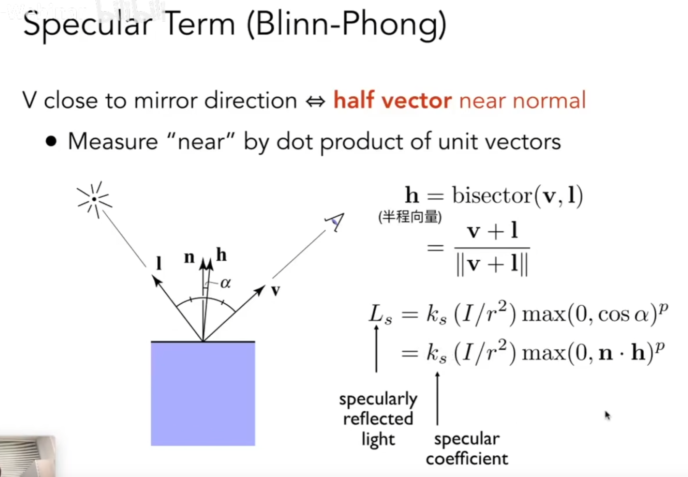

# 着色
冯氏反射模型：高光、漫反射、环境光照（间接）

着色是局部的，只考虑自己，不考虑其他物体，影子不属于着色

物体的亮度与光线的角度相关

# 漫反射
和观察角度无关

# 高光
与观察角度有关，通过角平分线方向的向量和法线夹角计算

> 一般在布林冯模型中p是100到200
> 处理指数运算可以用快速幂算法，复杂度为logn

# 环境光
可以看做常量，需要用到全局光照知识

布林冯反射模型是基于经验，而不是真实物理规则的模型

# 着色频率（所有法线记得要归一化）
逐顶点法线着色，根据这个点所有相邻面的法线加权（对应多边形的面积）平均得到一个顶点的法线（也可以不加权平均）

逐像素法线着色，利用重心坐标

实际情况下，法线一般不是实际运行时计算的，计算量太大，一般是烘焙时就做好了。

# 管线Pipeline

# 纹理
模型转成UV图

无缝纹理被称为TilabledTexture，有一种王氏Tile算法可以处理

